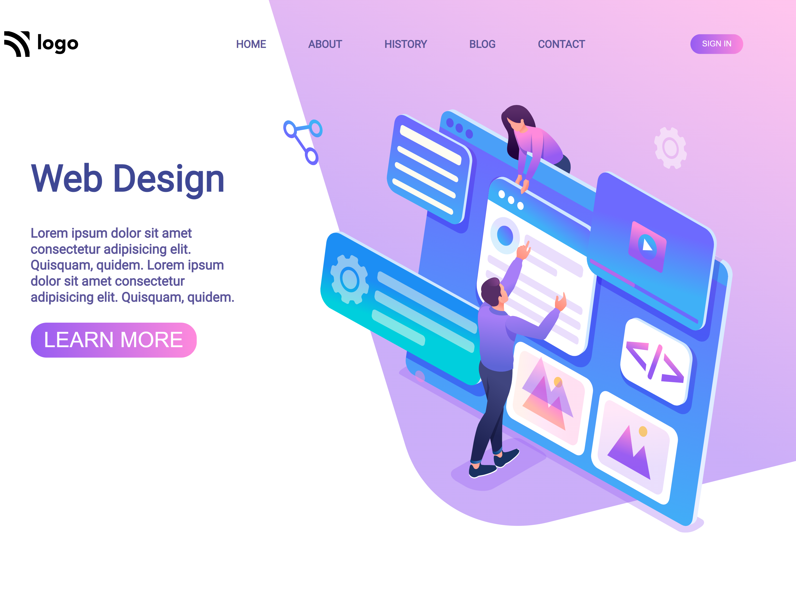
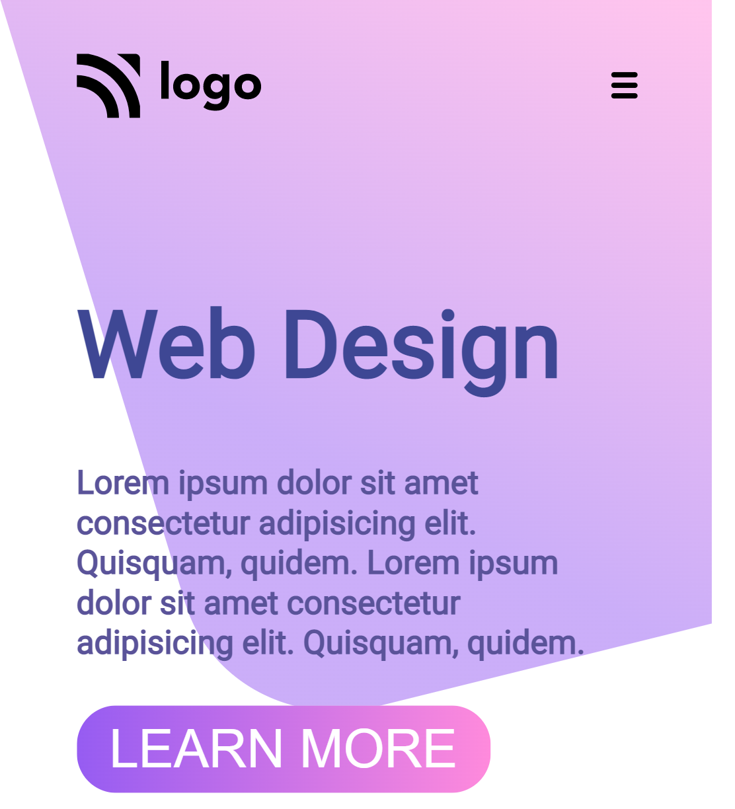

# Hello I am **Devang** and Welcome to **Web Design Landing Page**.

## 💻 Tech Stack Used :

  

 

 ## Project Name : Web Design Landing Page !

 

I enjoyed learning about various the background image property  while making this project. Background cover contain and auto help me navigating towards the end of this project.

 

 ## Time for completion: 10 hrs 
 

For devices width below 600px this looks like as follows

### Do Check it Live on Below Link :

[Live Link !](https://web-design-landing-pagee.netlify.app/)
